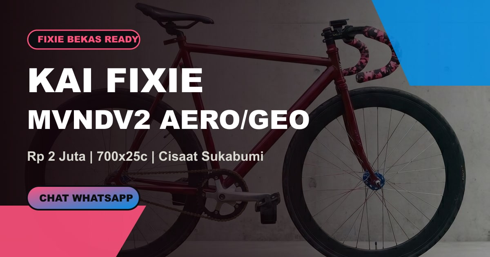

# Kai Fixie

Landing page modern untuk listing sepeda fixie bekas **MVNDV2 Aero/Geo Pursuit**. Proyek ini dibuat sebagai halaman jualan yang tetap layak dipresentasikan sebagai studi kasus web: punya foto asli, narasi produk, spek, kondisi plus-minus, CTA WhatsApp, SEO, Open Graph thumbnail, sitemap, robots, manifest, dan struktur data produk.



## Live Demo

Production:

```txt
https://fixie-bekas.vercel.app/
```

Halaman penjelasan proyek untuk dosen/presentasi UI/UX:

```txt
https://fixie-bekas.vercel.app/tentang-proyek
```

Keyword SEO utama:

```txt
Kai Fixie
```

## Highlights

- Single-page landing page berbasis Next.js App Router.
- Visual identity mengikuti warna sepeda: maroon frame, pink bar tape, blue hub, black wheelset, dan chrome accent.
- Hero full-bleed dengan foto asli unit.
- Section presentasi: build story, target rider, deal flow, project case study, dan SEO readiness.
- Detail produk lengkap: harga, lokasi, spek part, bonus, kondisi plus, dan minus jujur.
- CTA WhatsApp langsung ke nomor penjual.
- Embed Google Maps dan tombol rute ke titik cek barang.
- Open Graph thumbnail untuk share link.
- Favicon dan Apple touch icon.
- SEO metadata, canonical URL, sitemap, robots, manifest, dan JSON-LD structured data.
- Script maintenance untuk optimasi gambar dan generate aset SEO.

## Tech Stack

| Area | Teknologi |
| --- | --- |
| Framework | Next.js 16 App Router |
| UI | React 19 |
| Styling | Global CSS |
| Image Optimization | `next/image` + Sharp script |
| SEO | Metadata API, Open Graph, Twitter Card, JSON-LD |
| Deploy Target | Vercel |

## Project Structure

```txt
app/
  layout.jsx              # metadata, SEO, icon, manifest reference
  page.jsx                # landing page UI
  tentang-proyek/page.jsx # halaman case study UI/UX untuk presentasi
  manifest.js             # web app manifest route
  robots.js               # robots.txt route
  sitemap.js              # sitemap.xml route
assets/
  fixie-*.jpg             # foto asli sepeda
data/
  product.js              # semua data produk, SEO, case study, JSON-LD
public/
  og-image.jpg            # thumbnail share social/WhatsApp
  icon.png                # favicon/tab icon
  apple-touch-icon.png    # Apple icon
  google42b72afb76485d98.html
scripts/
  optimize-images.mjs     # kompres foto aset
  generate-seo-assets.mjs # generate OG thumbnail dan icon
styles.css                # seluruh styling visual
```

## Getting Started

Install dependency:

```bash
npm install
```

Jalankan dev server:

```bash
npm run dev
```

Buka:

```txt
http://127.0.0.1:3000
```

Build production:

```bash
npm run build
```

## Available Scripts

| Script | Fungsi |
| --- | --- |
| `npm run dev` | Menjalankan dev server lokal |
| `npm run build` | Build production Next.js |
| `npm run start` | Menjalankan hasil production build |
| `npm run check` | Alias build untuk verifikasi cepat |
| `npm run optimize:images` | Kompres ulang foto di `assets/` |
| `npm run seo:assets` | Generate `public/og-image.jpg`, `icon.png`, dan Apple icon |

## SEO Setup

Proyek ini sudah menyiapkan:

- Title dan description dengan keyword `Kai Fixie`.
- Canonical URL ke `https://fixie-bekas.vercel.app/`.
- Open Graph image 1200x630.
- Twitter Card `summary_large_image`.
- `robots.txt`.
- `sitemap.xml`.
- `manifest.webmanifest`.
- JSON-LD `WebSite`.
- JSON-LD `Product` + `Offer`.
- File verifikasi Google Search Console.

Setelah deploy, submit sitemap ini di Google Search Console:

```txt
https://fixie-bekas.vercel.app/sitemap.xml
```

Catatan: SEO readiness membantu Google memahami halaman, tetapi tidak menjamin langsung ranking paling atas. Ranking tetap dipengaruhi indexing, kompetisi keyword, performa, backlink, dan perilaku pengguna.

## Update Konten Listing

Mayoritas konten bisa diedit di:

```txt
data/product.js
```

Yang biasanya diganti:

- Nama/brand listing.
- Harga.
- Nomor WhatsApp.
- Lokasi.
- Spek part.
- Kondisi plus-minus.
- Foto galeri.
- Keyword SEO.
- Structured data.

Setelah mengganti foto, jalankan:

```bash
npm run optimize:images
npm run seo:assets
npm run check
```

## Deployment Notes

Project ini siap deploy ke Vercel. Node.js dipin ke major version stabil:

```json
{
  "engines": {
    "node": "22.x"
  }
}
```

Dependency juga dibuat exact via `.npmrc`:

```txt
save-exact=true
```

## Presentation Angle

Kalau dipakai untuk presentasi tugas, poin yang bisa dibawa:

1. Masalah: listing sepeda bekas sering kurang meyakinkan karena informasi tersebar.
2. Solusi: landing page satu halaman yang menggabungkan foto asli, spek, kondisi, harga, dan kontak.
3. Target pengguna: calon pembeli fixie bekas, commuter harian, starter fixie, dan pencinta build custom.
4. Nilai teknis: responsive design, SEO metadata, structured data, optimized images, dan deploy-ready.
5. Nilai bisnis: CTA WhatsApp langsung, trust layer, transparansi plus-minus, dan share preview profesional.

## Maintenance Checklist

Sebelum deploy:

```bash
npm run optimize:images
npm run seo:assets
npm run check
npm audit --omit=dev
```

Catatan audit: hindari langsung menjalankan `npm audit fix --force` tanpa membaca dampaknya, karena bisa mengganti versi dependency secara agresif.

## License

Project ini dibuat untuk kebutuhan portofolio, presentasi, dan listing produk pribadi.
